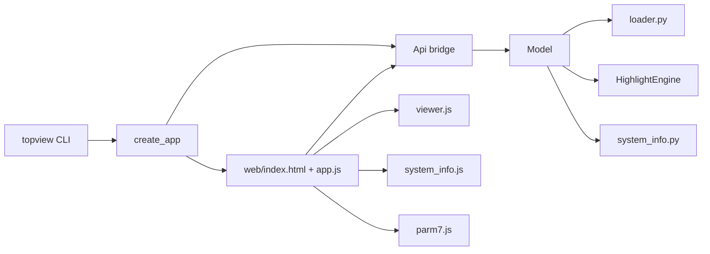

# Codebase Map: `topview`

## Scope
- Repository type: Python desktop app (`pywebview`) with an embedded JS frontend (`3Dmol.js` + RDKit SVG support).
- Primary domain: AMBER topology inspection (`parm7/prmtop`) with optional coordinates (`rst7/inpcrd`).
- In-scope source index coverage:
  - `topview/**/*.py`
  - `web/src/*.js`, `web/index.html`, `web/styles.css`
  - `scripts/*.py`
  - `tests/*.py`
  - `README.md`, `pyproject.toml`
- Excluded from symbol enumeration:
  - `web/vendor/3Dmol-min.js` (minified third-party bundle)
  - `tests/data/*` (input fixtures, not source)

## Diagram Assets
- `codebase-analysis-docs/assets/architecture-overview.mmd`
- `codebase-analysis-docs/assets/main-execution-sequence.mmd`
- `codebase-analysis-docs/assets/module-dependencies.mmd`

---

## PHASE 0 — Index & Triage (Pass 0)

### Repo Structure
- `topview/`: Python application core (CLI, model, services, API bridge).
- `web/`: frontend UI and viewer logic loaded by pywebview.
- `tests/`: Python unit/integration tests.
- `scripts/`: standalone diagnostic tool for parm7 dihedral semantics.
- `docs/`: previous map artifact.
- `daux/`: local sample data (ignored by `.gitignore`).

### Language/Tooling
- Python: `>=3.9` via `pyproject.toml`.
- Build/packaging: setuptools (`pyproject.toml`, `project.scripts.topview`).
- Frontend: vanilla ES modules (`web/src/*.js`), static HTML/CSS.
- Runtime native/GUI bridge: `pywebview` + Qt.
- Scientific stack:
  - MDAnalysis (3D load path)
  - ParmEd (parm7-only parse path)
  - RDKit (2D depiction in parm7-only mode)
  - NumPy/Pandas for numeric parsing + table construction

### Sources of Truth
- Format parser and tokenization: `topview/services/parm7.py`.
- Load pipeline + per-atom metadata: `topview/services/loader.py`.
- Selection/highlight semantics: `topview/model/highlights.py`, `topview/services/system_info_selection.py`.
- System info table schema: `topview/services/system_info.py`.
- UI mode/state contracts: `web/src/constants.js`, `web/src/state.js`.

### FILE INDEX (priority scored)
Format: `(#) PRIORITY | PATH | TYPE | LINES | HASH8 | NOTES`

1. `P0` | `topview/model/highlights.py` | py | 1084 | `acd2a5b7` | Core selection/highlight semantics across all modes.
2. `P0` | `topview/services/system_info.py` | py | 1221 | `c75175a5` | Builds all info tables and rotatable/improper rules.
3. `P0` | `topview/services/loader.py` | py | 966 | `5ebe31cf` | Main data ingress (3D/2D), metadata, LJ, depiction.
4. `P0` | `topview/model/model.py` | py | 729 | `e4edd6fb` | Central state manager and API-facing behavior.
5. `P0` | `topview/bridge.py` | py | 619 | `0f692ed9` | Python-JS RPC boundary.
6. `P0` | `web/src/viewer.js` | js | 1429 | `e26e5b8b` | 3D/2D rendering, highlighting, labeling, export.
7. `P0` | `web/src/system_info.js` | js | 790 | `c52eb317` | Info panel rendering/sorting/selection bridging.
8. `P0` | `topview/services/system_info_selection.py` | py | 329 | `9f0f32f9` | Row-to-selection mapping index.
9. `P1` | `topview/services/parm7.py` | py | 459 | `9a3f4291` | Token parser + pointer decode + ref descriptions.
10. `P1` | `topview/services/lj.py` | py | 271 | `b1bec2d7` | LJ table math and validation.
11. `P1` | `web/src/app.js` | js | 399 | `5f276ae3` | Frontend bootstrap/orchestration.
12. `P1` | `web/src/selection.js` | js | 350 | `a4a7bea8` | Selection state machine.
13. `P1` | `web/src/parm7.js` | js | 452 | `f4f2839c` | Parm7 virtualization/highlight panel.
14. `P1` | `web/src/ui.js` | js | 474 | `42554192` | Details/about/status rendering.
15. `P1` | `topview/app.py` | py | 125 | `f7d24713` | CLI + app startup.
16. `P1` | `topview/model/state.py` | py | 198 | `932022a2` | Core typed state contracts.
17. `P1` | `topview/model/query.py` | py | 103 | `ecc12646` | Atom filtering.
18. `P1` | `web/src/bridge.js` | js | 155 | `f64a5b0a` | JS RPC wrapper.
19. `P2` | `topview/services/pdb_writer.py` | py | 83 | `293febc1` | PDB serialization.
20. `P2` | `topview/worker.py` | py | 82 | `80ce17ea` | Thread/process executor abstraction.
21. `P2` | `topview/config.py` | py | 51 | `e4c9445b` | Global constants/paths.
22. `P2` | `topview/errors.py` | py | 98 | `79ecbc1f` | Error model + API payload builder.
23. `P2` | `web/src/constants.js` | js | 52 | `95f70c7d` | Mode/style constants.
24. `P2` | `web/src/state.js` | js | 65 | `0f64a007` | Shared frontend mutable state.
25. `P2` | `web/src/utils.js` | js | 83 | `06622dfb` | Frontend helpers.
26. `P2` | `web/index.html` | html | 97 | `1794becf` | UI layout skeleton.
27. `P2` | `web/styles.css` | css | 815 | `b630da3d` | UI styling/themes.
28. `P2` | `scripts/check_parm7_dihedrals.py` | py | 278 | `82e18230` | External diagnostic script.
29. `P3` | `tests/test_system_info_selection.py` | py | 120 | `979803ba` | Core row-selection correctness tests.
30. `P3` | `tests/test_rotatable_dihedral.py` | py | 98 | `c5202c5e` | Rotatable/dihedral table tests.
31. `P3` | `tests/test_lj_parmed.py` | py | 53 | `2b32b193` | LJ parity with ParmEd.
32. `P3` | `tests/test_improper_selection.py` | py | 48 | `8c9d0de6` | Improper sign convention test.
33. `P3` | `tests/test_rdkit_depiction.py` | py | 34 | `3c247c49` | 2D depiction load path.
34. `P3` | `tests/test_mapping.py` | py | 43 | `a13a562f` | PDB serial ordering test.
35. `P3` | `tests/test_cli.py` | py | 14 | `fdce451b` | CLI arg defaults.
36. `P3` | `README.md` | md | 51 | `7640f79f` | User-facing usage docs.
37. `P3` | `pyproject.toml` | toml | 45 | `ea2826f3` | Packaging/dependency metadata.
38. `P3` | `topview/__main__.py` | py | 7 | `85f9c680` | `python -m topview` entry.
39. `P3` | `topview/cli/topview.py` | py | 13 | `8c1bf167` | console script entry.
40. `P3` | `topview/__init__.py` | py | 5 | `ed32e657` | package version export.
41. `P3` | `topview/logging_config.py` | py | 52 | `0a6bf678` | logging setup.
42. `P3` | `topview/model/__init__.py` | py | 6 | `bd820985` | model exports.
43. `P3` | `topview/services/__init__.py` | py | 1 | `64dfd3ea` | services package marker.
44. `P3` | `topview/cli/__init__.py` | py | 1 | `d27ff657` | cli package marker.
45. `P3` | `web/vendor/3Dmol-min.js` | js(min) | 1 | `c24a17b2` | Third-party vendor bundle.

### Initial Architecture Hypothesis
- Backend is authoritative for topology parsing, selection semantics, and numeric table generation.
- Frontend is primarily rendering + UX state + RPC orchestration.
- `Model` is the central contract surface; `Api` is mostly validation/error wrapping.

### STATE BLOCK (Phase 0)
- `INDEX_VERSION`: `v1`
- `FILE_MAP_SUMMARY`: Python core + frontend modules + tests fully indexed.
- `OPEN QUESTIONS`:
  - `topview/config.py` references `daux/src_parm7_ref.md`, but file is absent in this checkout.
- `KNOWN RISKS`:
  - Some frontend controls referenced in JS are absent in current HTML layout.
- `GLOSSARY_DELTA`:
  - `parm7`, `rst7`, `NATOM`, `NTYPES`, `1-4 nonbonded`, `improper`.

---

## PHASE 1 — Project Context Scan

### What This Software Is
`topview` is an offline desktop inspector for AMBER parameter/topology files.

Core user workflows:
- Load `parm7 + rst7` for interactive 3D viewing and atom-level parameter inspection.
- Load `parm7` only, pick one residue, and inspect an RDKit-derived 2D depiction.
- Explore force-field relationships (bond/angle/dihedral/improper/1-4/nonbonded) through linked viewer, parm7 text highlights, and info tables.

### Primary Usage Modes
- Desktop GUI via `topview` CLI (`pywebview` host + HTML/JS frontend).
- Programmatic model/service usage in tests.
- Diagnostic script mode via `scripts/check_parm7_dihedrals.py`.

### Startup Spine
1. `topview/app.py` parses CLI args and creates window/API/model/worker.
2. `web/index.html` loads `web/src/app.js`.
3. On `pywebviewready`, frontend requests initial paths + UI config.
4. Frontend calls `load_system`; backend populates `ModelState`.
5. Frontend loads parm7 text, section metadata, and system info tables.

### STATE BLOCK (Phase 1)
- `INDEX_VERSION`: `v2`
- `FILE_MAP_SUMMARY`: Execution spine confirmed from CLI to API to model/services to frontend rendering.
- `OPEN QUESTIONS`:
  - None on startup order.
- `KNOWN RISKS`:
  - Missing `status`/toolbar nodes means some UI status controls are no-ops.
- `GLOSSARY_DELTA`:
  - `ModelState`, `SystemLoadResult`, `HighlightEngine`, `SystemInfoSelectionIndex`.

---

## PHASE 2 — Architecture & Compute/Data Flow Deep Dive

### Component Map
- Entry and host:
  - `topview/app.py`
  - `topview/worker.py`
- Bridge/API layer:
  - `topview/bridge.py`
- Domain model/state:
  - `topview/model/model.py`
  - `topview/model/state.py`
  - `topview/model/highlights.py`
  - `topview/model/query.py`
- Data services:
  - `topview/services/loader.py`
  - `topview/services/parm7.py`
  - `topview/services/lj.py`
  - `topview/services/system_info.py`
  - `topview/services/system_info_selection.py`
  - `topview/services/pdb_writer.py`
- Frontend modules:
  - `web/src/app.js`, `bridge.js`, `state.js`, `selection.js`, `viewer.js`, `parm7.js`, `system_info.js`, `ui.js`, `utils.js`

### Main Compute/Data Flow
1. Load request enters `Api.load_system` and is dispatched on worker.
2. `Model.load_system` calls `load_system_data`.
3. `load_system_data` chooses:
   - 3D path (`load_system_data_3d`): MDAnalysis universe + parm7 parse in parallel.
   - 2D path (`load_system_data_2d`): parm7 parse + ParmEd + RDKit depiction.
4. Loader builds atom metadata (`AtomMeta`) including:
   - residue identity
   - coordinates
   - atom type and LJ derivations
   - charge normalization (`CHARGE_SCALE = 18.2223`)
5. Model caches payload and lazily computes:
   - system info tables (async if CPU executor available)
   - system info selection index
   - bond adjacency for improper checks
6. Frontend requests:
   - parm7 text/sections for virtualized source display
   - system info tables for tabular navigation
   - selection-driven highlights and interaction payloads

### Parallelism Model
- Backend:
  - `ThreadPoolExecutor` for API calls.
  - Optional `ProcessPoolExecutor` (`max_processes=1`) for CPU-heavy work (`build_system_info_tables_with_timing`).
  - Loader uses a local `ThreadPoolExecutor(max_workers=2)` to parse `parm7` and load MDAnalysis universe concurrently.
- Frontend:
  - Render throttling via `requestAnimationFrame` in `viewer.js`.
  - Parm7 view virtualization and scroll scheduling.

### Determinism/Reproducibility
- Deterministic mapping primitives:
  - pointer-to-serial conversion: `abs(value)//3 + 1`
  - improper classification: raw L index `< 0`
  - grouped table outputs are sorted by type/index columns.
- Potential nondeterminism areas:
  - asynchronous timing/order of some UI updates (selection nonce logic mitigates stale updates).

### Precision and Numeric Semantics
- Fortran exponent support (`D`/`d`) is normalized to `E` in float parsing.
- Two related but distinct LJ distances appear:
  - per-type diagonal `rmin/2` in loader atom metadata (`*0.5` factor)
  - pairwise `rmin` in nonbonded tables/interactions (no `/2` factor)
- NaNs are normalized to `None` in table output serialization.

### Architecture Diagram
See `codebase-analysis-docs/assets/architecture-overview.mmd`.

### Execution Sequence Diagram
See `codebase-analysis-docs/assets/main-execution-sequence.mmd`.

### Dependency Diagram
See `codebase-analysis-docs/assets/module-dependencies.mmd`.

### STATE BLOCK (Phase 2)
- `INDEX_VERSION`: `v3`
- `FILE_MAP_SUMMARY`: Core backend/frontend execution and compute flow confirmed.
- `OPEN QUESTIONS`:
  - None on selected code paths.
- `KNOWN RISKS`:
  - UI has compatibility/stale hooks for controls not present in current HTML.
- `GLOSSARY_DELTA`:
  - `bond_adjacency`, `row cursor`, `selection nonce`, `virtualized parm7 window`.

---

## PHASE 3 — Capability-by-Capability Analysis

### Capability 1: System Loading (3D and 2D)
- Purpose: ingest topology/coordinates, normalize metadata, and prepare render payloads.
- Entry points:
  - `Api.load_system`
  - `Model.load_system`
  - `load_system_data_3d`, `load_system_data_2d`
- Core modules:
  - `topview/services/loader.py`
  - `topview/services/parm7.py`
  - `topview/services/lj.py`
  - `topview/services/pdb_writer.py`
- Data structures:
  - `SystemLoadResult`, `AtomMeta`, `ResidueMeta`, `Parm7Section`
- Side effects:
  - in-memory cache update (`ModelState`)
  - no file writes on load

### Capability 2: Selection & Force-Field Highlighting
- Purpose: map atom/interaction selection to parm7 token spans + parameter payloads.
- Entry points:
  - frontend `selectAtom`, `applySelectionFromSystemInfo`
  - backend `Model.get_parm7_highlights`
- Core modules:
  - `topview/model/highlights.py`
  - `web/src/selection.js`
  - `web/src/viewer.js`
  - `web/src/parm7.js`
- Invariants:
  - Improper dihedrals use negative raw L index.
  - 1-4 terms require non-negative `raw_k` and `raw_l`.
  - selection dedupe and stale async protection via nonce.

### Capability 3: System Info Tables
- Purpose: build tabular aggregated force-field descriptors for exploration.
- Entry points:
  - `Model.get_system_info`
  - `build_system_info_tables`
- Tables built:
  - `atom_types`, `bond_types`, `angle_types`, `dihedral_types`, `improper_types`, `one_four_nonbonded`, `nonbonded_pairs`
- Edge logic:
  - rotatable detection from heavy central bonds + terminal-neighbor disjointness
  - improper table only from records with negative raw L

### Capability 4: Row-to-Selection Mapping
- Purpose: selecting a table row highlights specific atom tuples in viewer/parm7.
- Entry points:
  - frontend `getSystemInfoSelection(table,row,cursor)`
  - backend `Model.get_system_info_selection`
- Core module:
  - `topview/services/system_info_selection.py`
- Semantics:
  - multiple matches cycle by cursor
  - same-type nonbonded pairs use combinatorial indexing (`n choose 2`)

### Capability 5: UI Rendering and Export
- Purpose: synchronized 3D/2D visuals and data panels.
- Entry points:
  - `web/src/app.js`
  - `web/src/viewer.js`
- Features:
  - style presets, theme switching, water/H visibility toggles
  - CSV export of active info table
  - PNG export via backend save dialog
  - parm7 line virtualization with section focus and token highlighting

### Where to Modify Code (Common Extensions)
- Add a new interaction mode:
  - Backend: `topview/model/highlights.py`, `topview/model/model.py` mode mapping.
  - Tables/selection: `topview/services/system_info.py`, `topview/services/system_info_selection.py`.
  - Frontend: `web/src/constants.js`, `web/src/selection.js`, `web/src/system_info.js`, `web/src/ui.js`, `web/index.html` tabs.
- Add a new input format:
  - Extend loader split in `topview/services/loader.py`.
  - Add parser module under `topview/services/` and map into `Model.load_system`.
- Add a new feature flag/config:
  - `topview/config.py` + argument plumbing in `topview/app.py` + API payload in `topview/bridge.py` + frontend state usage.
- Add benchmark/validation test:
  - Start with `tests/test_lj_parmed.py` pattern for parity checks and `tests/test_system_info_selection.py` for integration behavior.

### STATE BLOCK (Phase 3)
- `INDEX_VERSION`: `v4`
- `FILE_MAP_SUMMARY`: Five major capabilities mapped with call paths and extension points.
- `OPEN QUESTIONS`:
  - None blocking extension planning.
- `KNOWN RISKS`:
  - Mode expansion touches many files; easy to desynchronize labels/mappings.
- `GLOSSARY_DELTA`:
  - `term_idx`, `param_index`, `cursor cycling`, `rotatable bond heuristic`.

---

## PHASE 4 — Nuances, Subtleties & Gotchas

## Things You Must Know Before Changing This Codebase
- Improper semantics are sign-based, not geometric-inference-based at table/highlight source:
  - `raw_l < 0` is the explicit improper indicator.
- Pointer decoding is structural and repeated across modules:
  - serial conversion must stay `abs(ptr)//3 + 1`.
- `ModelState` has lazy/asynchronous caches:
  - changing load/reset behavior requires careful invalidation (`system_info`, selection index, adjacency).
- UI selection correctness relies on `selectionNonce`:
  - async bridge responses must check staleness before mutating state.
- There are stale/optional UI hooks:
  - JS references ids like `open-btn`, `load-btn`, `status`, `parm7-path`, `rst7-path` that are not present in current `web/index.html`.
  - code degrades by null checks; if you reintroduce controls, IDs must match.
- `PARM7_REFERENCE_PATH` currently points to a missing file in this checkout:
  - section descriptions and deprecated flags silently degrade to empty results.
- Numeric consistency trap:
  - per-atom LJ uses `rmin/2`; pairwise nonbonded tables expose `rmin`.
- Process pool behavior:
  - `Worker(max_processes=1)` uses `spawn`; ensure callables submitted are pickle-safe.

### STATE BLOCK (Phase 4)
- `INDEX_VERSION`: `v5`
- `FILE_MAP_SUMMARY`: Correctness/performance/config gotchas captured.
- `OPEN QUESTIONS`:
  - Whether missing reference markdown is intentional for this branch.
- `KNOWN RISKS`:
  - Silent feature degradation from missing reference docs and missing UI nodes.
- `GLOSSARY_DELTA`:
  - `raw_l`, `spawn`, `pickle-safe`, `stale response guard`.

---

## PHASE 5 — Technical Reference, Glossary, and Source Index

## Key APIs and Types
- `Model` (`topview/model/model.py`): authoritative backend API for load/query/highlight/system-info flows.
- `Api` (`topview/bridge.py`): pywebview RPC surface and error-normalization boundary.
- `AtomMeta`, `ResidueMeta`, `Parm7Section`, `ModelState` (`topview/model/state.py`): canonical in-memory data contracts.
- `SystemLoadResult` (`topview/services/loader.py`): load pipeline output contract.
- `SystemInfoSelectionIndex` (`topview/services/system_info_selection.py`): table-row to atom-selection index.

## I/O and Format Contracts
- Input:
  - `parm7/prmtop` required.
  - `rst7/inpcrd` optional (required for 3D coordinates).
- Output to frontend:
  - 3D mode: base64 PDB (`pdb_b64`).
  - 2D mode: RDKit SVG depiction payload.
  - Always: base64 parm7 text + tokenized sections + system info tables.
- Save operations:
  - CSV via `Api.save_system_info_csv`.
  - PNG via `Api.save_viewer_image`.

## Testing and Validation
- Coverage focus:
  - CLI parsing defaults.
  - LJ parity with ParmEd.
  - PDB serial formatting.
  - improper selection sign convention.
  - rotatable-dihedral logic.
  - system-info row selection mapping.
- Current environment gap:
  - `pytest` not installed in this session (tests not executable here).

## Comprehensive Source File Index (Symbol Map)

### Backend Python

## `topview/__init__.py`
- Role: package metadata export.
- Key dependencies: none.
- Defines:
  - Globals/Constants:
    - `__version__`: package version string.
    - `__all__`: public export list.

## `topview/__main__.py`
- Role: module entry for `python -m topview`.
- Key dependencies: `topview.app.main`.
- Defines:
  - Functions:
    - `main()`: delegates to app main.

## `topview/app.py`
- Role: application startup and CLI parsing.
- Key dependencies: `webview`, `topview.bridge.Api`, `topview.model.Model`, `topview.worker.Worker`.
- Defines:
  - Functions:
    - `_parse_args(argv)`: parse CLI args (`parm7_path`, `rst7_path`, `resname`, logging/font options).
    - `create_app(initial_paths, info_font_size, initial_resname)`: construct worker/model/API/window.
    - `main()`: configure logging, create app, start pywebview.

## `topview/bridge.py`
- Role: pywebview RPC bridge between frontend and model.
- Key dependencies: `webview`, `topview.model.Model`, `topview.worker.Worker`, `topview.errors`.
- Defines:
  - Classes:
    - `Api`: bridge object bound as `js_api`.
  - Methods (major):
    - `set_window(...)`
    - `get_initial_paths(...)`
    - `get_ui_config(...)`
    - `load_system(payload)`
    - `get_atom_info(payload)`
    - `get_atom_bundle(payload)`
    - `query_atoms(payload)`
    - `get_residue_info(payload)`
    - `get_parm7_text(...)`
    - `get_parm7_sections(...)`
    - `get_parm7_highlights(payload)`
    - `get_system_info(...)`
    - `get_system_info_selection(payload)`
    - `save_system_info_csv(payload)`
    - `save_viewer_image(payload)`
    - `select_files(...)`
    - `log_client_error(payload)`
  - Notes:
    - Standardizes all unexpected exceptions into `error_result(...)` payloads.

## `topview/cli/__init__.py`
- Role: CLI package marker.
- Key dependencies: none.
- Defines: no runtime symbols.

## `topview/cli/topview.py`
- Role: console-script entrypoint target.
- Key dependencies: `topview.app.main`.
- Defines:
  - Functions:
    - `main()`: delegates to app.

## `topview/config.py`
- Role: central constants and filesystem path config.
- Key dependencies: `pathlib.Path`.
- Defines:
  - Globals/Constants:
    - app/window defaults (`APP_NAME`, `WINDOW_TITLE`, sizes)
    - chemistry constants (`CHARGE_SCALE`)
    - path constants (`WEB_DIR`, `INDEX_PATH`, `PARM7_REFERENCE_PATH`)
    - `PARM7_TOKEN_SECTIONS`: sections tokenized for highlighting and downstream parsing.

## `topview/errors.py`
- Role: typed domain exceptions and RPC-friendly error payloads.
- Key dependencies: standard typing.
- Defines:
  - Classes:
    - `TopviewError`
    - `ModelError`
    - `ApiError`
    - `PdbWriterError`
  - Functions:
    - `error_result(code, message, details=None)`

## `topview/logging_config.py`
- Role: logging setup for app and dependency noise control.
- Key dependencies: `logging`, `warnings`.
- Defines:
  - Functions:
    - `configure_logging(log_file)`

## `topview/model/__init__.py`
- Role: model package exports.
- Key dependencies: `topview.model.model`, `topview.model.state`.
- Defines:
  - Globals/Constants:
    - `__all__`

## `topview/model/state.py`
- Role: typed metadata/state containers.
- Key dependencies: `dataclasses`, `concurrent.futures.Future`.
- Defines:
  - Classes:
    - `ResidueMeta`
    - `AtomMeta`
    - `Parm7Token`
    - `Parm7Section`
    - `ModelState`
  - Methods:
    - `ResidueMeta.to_dict()`
    - `AtomMeta.to_dict()`
  - Notes:
    - `ModelState` stores lazy caches and background futures.

## `topview/model/query.py`
- Role: atom-filter logic for frontend query UI.
- Key dependencies: `AtomMeta`.
- Defines:
  - Functions:
    - `query_atoms(meta_list, filters, max_results=50000)`

## `topview/model/highlights.py`
- Role: selection-to-parm7-highlight and interaction payload engine.
- Key dependencies: `ModelError`, `AtomMeta`, `Parm7Section`, parm7 parse helpers.
- Defines:
  - Classes:
    - `HighlightEngine`
  - Methods (major):
    - `build_atom_highlights(...)`
    - `get_highlights(serials, mode=None)`
    - `_extract_bond_params(...)`
    - `_extract_angle_params(...)`
    - `_extract_dihedral_params(...)`
    - `_extract_improper_params(...)`
    - `_extract_14_params(...)`
    - `_extract_nonbonded_params(...)`
    - `_highlight_bond_entries(...)`
    - `_highlight_angle_entries(...)`
    - `_highlight_dihedral_entries(...)`
    - `_highlight_improper_entries(...)`
    - `_highlight_nonbonded_pair(...)`
    - `_highlight_14_pairs(...)`
  - Notes:
    - Improper terms are keyed by negative raw L index.
    - Nonbond fallback checks both type ordering directions in nonbond matrix.

## `topview/model/model.py`
- Role: primary backend facade and state coordinator.
- Key dependencies: `HighlightEngine`, loader/system-info/selection services.
- Defines:
  - Classes:
    - `Model`
  - Methods (major):
    - `load_system(...)`
    - `get_atom_info(...)`
    - `get_atom_bundle(...)`
    - `query_atoms(...)`
    - `get_residue_info(...)`
    - `get_parm7_text()`
    - `get_parm7_sections()`
    - `get_parm7_highlights(serials, mode)`
    - `get_system_info()`
    - `get_system_info_selection(table, row_index, cursor=0)`
    - `_get_system_info_selection_index()`
    - `_get_bond_adjacency()`
  - Functions:
    - `_mode_for_table(table)`
    - `_coerce_int(value)`
    - `_bond_key(row_map)`
    - `_angle_key(row_map)`
    - `_selection_result(mode, selections, cursor_idx)`

## `topview/services/__init__.py`
- Role: services package marker.
- Key dependencies: none.
- Defines: no runtime symbols.

## `topview/services/parm7.py`
- Role: low-level parm7 tokenizer and section metadata support.
- Key dependencies: `mmap`, `re`, `numpy`, config and state dataclasses.
- Defines:
  - Globals/Constants:
    - `POINTER_NAMES`
    - `_PARM7_DESCRIPTIONS`, `_PARM7_DEPRECATED`
  - Functions:
    - `parse_parm7(path)`
    - `describe_section(section)`
    - `load_parm7_descriptions()`
    - `load_parm7_deprecated_flags()`
    - `parse_pointers(section)`
    - `parse_int_tokens(tokens)`
    - `parse_float_tokens(tokens)`
    - `parse_int_values(values)`
    - `parse_float_values(values)`
    - `parse_int_token_value(token)`
    - `parse_float_token_value(token)`

## `topview/services/lj.py`
- Role: LJ parameter extraction and derivation.
- Key dependencies: `numpy`, parm7 token parse helpers.
- Defines:
  - Globals/Constants:
    - `LJ_MIN_COEF`
    - `LJ_ONE_SIXTH`
  - Functions:
    - `_parse_fixed_int_values(values, expected_count, label)`
    - `_parse_fixed_float_values(values, expected_count, label)`
    - `build_lj_by_type(atom_type_indices, nonbond_index, acoef_values, bcoef_values)`
    - `build_lj_by_type_from_tokens(atom_type_indices, nonbond_tokens, acoef_tokens, bcoef_tokens)`
    - `compute_lj_tables(atom_type_values, nonbond_values, acoef_values, bcoef_values, natom, ntypes)`

## `topview/services/pdb_writer.py`
- Role: deterministic PDB text generation from atom metadata.
- Key dependencies: `PdbWriterError`.
- Defines:
  - Functions:
    - `_format_atom_name(name)`
    - `_format_resname(resname)`
    - `_format_element(element)`
    - `write_pdb(atom_metas)`

## `topview/services/loader.py`
- Role: end-to-end system loading pipeline (3D and 2D).
- Key dependencies: MDAnalysis, ParmEd, RDKit, parm7 parser, LJ and PDB services.
- Defines:
  - Classes:
    - `SystemLoadResult`
  - Functions:
    - `_timed_call(fn, *args, **kwargs)`
    - `_load_universe(parm7_path, rst7_path)`
    - `_guess_element(atom_name)`
    - `_safe_attr(atoms, attr)`
    - `_compute_lj_tables(parm7_sections, natom, ntypes)`
    - `_build_rdkit_depiction(residue, resname, width=600, height=400)`
    - `_parmed_import_error_message(exc)`
    - `load_system_data_3d(parm7_path, rst7_path, cpu_submit=None)`
    - `load_system_data_2d(parm7_path, resname=None)`
    - `load_system_data(parm7_path, rst7_path=None, resname=None, cpu_submit=None)`
  - Notes:
    - 3D path parallelizes universe load and parm7 parse.

## `topview/services/system_info.py`
- Role: builds info-panel tables from parsed parm7 sections.
- Key dependencies: `numpy`, `pandas`, pointer parser.
- Defines:
  - Globals/Constants:
    - `LJ_MIN_COEF`
  - Functions:
    - `build_system_info_tables(sections)`
    - `build_system_info_tables_with_timing(sections)`
    - `_pointer_value(...)`
    - `_parse_int_section(...)`
    - `_parse_float_section(...)`
    - `_parse_string_section(...)`
    - `_build_type_name_map(...)`
    - `_build_atom_type_table(...)`
    - `_build_bond_table(...)`
    - `_build_bond_adjacency(...)`
    - `_build_rotatable_bonds(...)`
    - `_build_angle_table(...)`
    - `_build_dihedral_table(...)`
    - `_build_improper_table(...)`
    - `_build_one_four_table(...)`
    - `_build_nonbonded_table(...)`
    - helper functions for parameter lookup and serialization.
  - Notes:
    - Rotatable detection uses heavy central bonds and non-overlapping terminal neighbor sets.

## `topview/services/system_info_selection.py`
- Role: precomputes row-selection lookup indexes.
- Key dependencies: parm7 integer parsing and pointers.
- Defines:
  - Classes:
    - `SystemInfoSelectionIndex`
  - Functions:
    - `build_system_info_selection_index(sections)`
    - `nonbonded_pair_total(serials_a, serials_b, same_type)`
    - `nonbonded_pair_for_cursor(serials_a, serials_b, cursor, same_type)`
    - `_pointer_value(...)`
    - `_parse_int_section(...)`
    - `_build_atom_serials_by_type(...)`
    - `_accumulate_bond_records(...)`
    - `_accumulate_angle_records(...)`
    - `_accumulate_dihedral_records(...)`
    - `_combination_pair_index(count, idx)`
    - helper pair/type functions.

## `topview/worker.py`
- Role: execution abstraction for threaded and optional process-based work.
- Key dependencies: `ThreadPoolExecutor`, `ProcessPoolExecutor`.
- Defines:
  - Functions:
    - `_ignore_sigint()`
  - Classes:
    - `Worker`
  - Methods:
    - `submit(...)`
    - `submit_cpu(...)`

### Frontend Web

## `web/src/bridge.js`
- Role: frontend RPC wrapper for `window.pywebview.api`.
- Key dependencies: browser global `window.pywebview`.
- Defines:
  - Functions:
    - `getApi()`
    - `hasApiMethod(name)`
    - `callApi(name, payload)`
    - RPC wrappers: `getUiConfig`, `getInitialPaths`, `loadSystem`, `getParm7Text`, `getParm7Sections`, `getSystemInfo`, `getSystemInfoSelection`, `saveSystemInfoCsv`, `saveViewerImage`, `getAtomBundle`, `getAtomInfo`, `getParm7Highlights`, `queryAtoms`, `selectFiles`, `logClientError`.

## `web/src/constants.js`
- Role: frontend global constants and mappings.
- Key dependencies: none.
- Defines:
  - Globals/Constants:
    - default modes/style keys and highlight constants.
    - `SECTION_MODE_MAP`
    - `STYLE_PRESETS`

## `web/src/state.js`
- Role: shared mutable client state singleton.
- Key dependencies: constants.
- Defines:
  - Globals/Constants:
    - `state` object containing viewer, selection, cache, sorting, parm7 virtualization, and 2D depiction state.

## `web/src/utils.js`
- Role: UI utility helpers.
- Key dependencies: none.
- Defines:
  - Functions:
    - `escapeHtml(text)`
    - `formatNumber(value)`
    - `decodeBase64(b64)`
    - `midpoint(posA, posB)`
    - `centroid(positions)`

## `web/src/viewer.js`
- Role: 3Dmol/RDKit rendering, highlighting, labels, image export, interaction geometry helpers.
- Key dependencies: constants, bridge save/export methods, UI status setter.
- Defines:
  - Globals/Constants:
    - highlight CSS class ids, overlay constants.
  - Exported Functions:
    - `requestRender()`
    - `applyTheme(isDark)`
    - `buildAtomIndex()`
    - `areBonded(serialA, serialB)`
    - `findBondPath(serials)`
    - `bondDistance(serialA, serialB, maxDepth=3)`
    - `load3Dmol()`
    - `ensureViewer()`
    - `resizeViewer(renderNow=true)`
    - `applyBaseStyle()`
    - `applyStylePreset(key, renderNow=true)`
    - `applyVisibilityFilters()`
    - `exportViewerImage(scale=1)`
    - `clearViewerHighlights()`
    - `highlightSerials(serials)`
    - `renderInteractionLabels(interaction)`
    - `render2dModel(depiction, onAtomClick, onEmptyClick)`
    - `renderModel(pdbB64, onAtomClick, onEmptyClick)`
  - Internal helpers include label builders, 2D click target overlay, and empty-click selection handling.

## `web/src/ui.js`
- Role: status, mode tabs, selection summary/details, about panel, and loading/UI config behavior.
- Key dependencies: bridge logger, state, formatting utilities.
- Defines:
  - Functions:
    - `setStatus(level, message, detail)`
    - `reportError(message)`
    - `setSelectionMode(mode)`
    - `renderInteractionTable(headers, rows)`
    - `formatInteractionDetails(mode, interaction)`
    - `selectionLabel(serial)`
    - `renderSelectionSummary()`
    - `updateAtomDetails(atom)`
    - `updateAboutPanel(atom)`
    - `toggleAboutPanel()`
    - `setLoading(isLoading)`
    - `applyUiConfig(config)`

## `web/src/parm7.js`
- Role: parm7 text virtualization, section navigation, and highlight rendering.
- Key dependencies: bridge highlight RPC, constants, shared state.
- Defines:
  - Globals/Constants:
    - `PARM7_SECTION_PREFS`
  - Exported Functions:
    - `resetParm7State()`
    - `setParm7SectionView(section)`
    - `updateParm7FontSize(value)`
    - `renderParm7File(highlights)`
    - `renderParm7Sections(sections)`
    - `autoSelectParm7Section(mode, highlights)`
    - `fetchParm7Highlights(serials, mode)`
    - `applyParm7SelectionHighlights(mode, highlights)`
    - `updateParm7Highlights(serials, mode)`
  - Internal helpers:
    - virtual window render pipeline (`buildParm7View`, `renderParm7Window`, scroll scheduling).

## `web/src/system_info.js`
- Role: info table tabs, sorting, row selection dispatch, highlight sync, CSV export.
- Key dependencies: bridge RPC, selection dispatcher, shared state, UI status/error functions.
- Defines:
  - Globals/Constants:
    - `INFO_TABS`, `HIGHLIGHT_COLORS`, `SORTABLE_COLUMNS`
  - Exported Functions:
    - `attachSystemInfoTabs()`
    - `attachSystemInfoExport()`
    - `attachSystemInfoRowActions()`
    - `updateInfoFontSize(value)`
    - `resetSystemInfoState()`
    - `loadSystemInfo()`
    - `updateSystemInfoHighlight(mode, interaction, atomInfo=null)`
  - Internal helpers:
    - sorting, row rendering, row selection handling, CSV generation.

## `web/src/selection.js`
- Role: selection state machine, cacheing, mode inference, async selection updates.
- Key dependencies: bridge atom RPC, viewer helpers, parm7/system-info synchronizers, UI functions.
- Defines:
  - Globals/Constants:
    - `SOURCE_VIEWER`, `SOURCE_SYSTEM_INFO`
  - Exported Functions:
    - `cacheAtom(serial, payload)`
    - `resetSelectionState()`
    - `clearSelection()`
    - `selectAtom(serial)`
    - `applySelectionFromSystemInfo(mode, serials)`
  - Internal helpers:
    - mode inference (`computeViewerSelection`), stale-response nonce guards.

## `web/src/app.js`
- Role: frontend bootstrap/orchestration.
- Key dependencies: all frontend subsystem modules.
- Defines:
  - Functions:
    - `loadFromInputs()`
    - `loadSystem(parm7Path, rst7Path, resname)`
    - `setInitialPaths(payload)`
    - `runFilter()`
    - `handleOpenDialog()`
    - `updateVisibilityButtons()`
    - `applyViewerStylePreset(key, renderNow=true)`
    - `attachEvents()`
  - Event hooks:
    - `pywebviewready`, `DOMContentLoaded`, `resize` listeners.

## `web/index.html`
- Role: static DOM layout for viewer/info/parm7 panes.
- Key dependencies: `styles.css`, `src/app.js` module.
- Defines:
  - DOM anchors for mode tabs, viewer controls, info panel tabs/content, and parm7 sections/view.

## `web/styles.css`
- Role: visual theme/layout and interaction styles.
- Key dependencies: DOM ids/classes from `index.html` and JS-generated classes.
- Defines:
  - CSS variables for theme colors/mode highlights.
  - layout rules for panels/viewer/labels.
  - table/sort/highlight styles.

### Scripts and Tests

## `scripts/check_parm7_dihedrals.py`
- Role: standalone CLI checker for dihedral record integrity against ParmEd topology adjacency.
- Key dependencies: `numpy`, `parmed`.
- Defines:
  - Functions:
    - `_pointer_to_serial(...)`
    - `_parse_parm7_sections(path)`
    - `_parse_pointers(pointer_tokens)`
    - `_parse_int_tokens(tokens)`
    - `_build_adjacency(structure)`
    - `_is_bonded(adjacency, a, b)`
    - `_is_improper_by_l_sign(raw_l)`
    - `_format_dihedral(serials)`
    - `_parse_dihedral_records(values)`
    - `main()`

## `tests/test_cli.py`
- Role: validates CLI parsing defaults and overrides.
- Defines:
  - Functions:
    - `test_parse_args_parm7_only_defaults_resname()`
    - `test_parse_args_resname_override()`

## `tests/test_improper_selection.py`
- Role: validates improper sign semantics in selection index.
- Defines:
  - Functions:
    - `make_section(name, values)`
    - `test_improper_selection_index()`

## `tests/test_lj_parmed.py`
- Role: validates LJ computations against ParmEd values.
- Defines:
  - Functions:
    - `_compute_topview_lj(parm7_path)`
    - `test_lj_matches_parmed()`

## `tests/test_mapping.py`
- Role: validates PDB serial formatting order.
- Defines:
  - Functions:
    - `test_pdb_writer_serials_order()`

## `tests/test_rdkit_depiction.py`
- Role: validates parm7-only 2D depiction path.
- Defines:
  - Functions:
    - `_first_resname(parm7_path)`
    - `test_parm7_only_loads_2d_depiction()`

## `tests/test_rotatable_dihedral.py`
- Role: validates rotatable bond heuristic and dihedral table schema.
- Defines:
  - Functions:
    - `make_section(name, values)`
    - `ptr(serial)`
    - `test_rotatable_bond_simple_true()`
    - `test_rotatable_bond_overlap_false()`
    - `test_dihedral_table_has_rotatable_column()`

## `tests/test_system_info_selection.py`
- Role: validates selection index and integration with loaded model.
- Defines:
  - Functions:
    - `_make_section(name, values)`
    - `_make_pointer_section(overrides)`
    - `test_selection_index_basic_mapping()`
    - `test_nonbonded_pair_indexing_cross_type()`
    - `test_nonbonded_pair_indexing_same_type()`
    - `test_system_info_selection_integration()`

### Project Metadata

## `README.md`
- Role: user-facing install/run notes and basic workflow docs.
- Key dependencies: CLI behavior assumptions.
- Defines:
  - Sections: requirements, install, run examples.

## `pyproject.toml`
- Role: packaging/build/runtime dependency declarations.
- Key dependencies: setuptools build backend.
- Defines:
  - `[project]` metadata.
  - dependencies (`MDAnalysis`, `parmed`, `pywebview`, `PyQt6`, `rdkit`, etc.).
  - script entrypoint: `topview`.

### Glossary
- `parm7/prmtop`: AMBER topology/parameter file.
- `rst7/inpcrd`: AMBER coordinate/restart file.
- `POINTERS`: parm7 section with key cardinalities (`NATOM`, `NTYPES`, etc.).
- `term_idx`/`idx`: one-based dihedral term occurrence index used in tables.
- `param_index`: index into parameter arrays (bond/angle/dihedral/LJ sections).
- `1-4 Nonbonded`: nonbonded interaction between dihedral terminal atoms.
- `Improper`: dihedral record with negative L pointer (`raw_l < 0`).
- `selection nonce`: UI guard against stale async responses.

### STATE BLOCK (Phase 5)
- `INDEX_VERSION`: `v6`
- `FILE_MAP_SUMMARY`: complete per-file symbol map generated for all in-scope source files.
- `OPEN QUESTIONS`:
  - none on symbol coverage.
- `KNOWN RISKS`:
  - minified vendor library not symbolized (intentional).
- `GLOSSARY_DELTA`:
  - completed.

---

## PHASE 6 — Final Assembly

## High-Level Overview
- `topview` is a hybrid Python+JS desktop system for force-field topology inspection.
- Backend owns scientific parsing/semantics; frontend owns visualization and interaction orchestration.

## Open Questions / Assumptions

### Assumptions
- `daux/` sample files are environment-local and not part of the intended distributable package contract.
- Missing `daux/src_parm7_ref.md` is tolerated by design because code falls back to empty descriptions.

### Open Questions
- Should missing UI controls referenced in JS be restored in `web/index.html`, or should dead hooks be removed?
- Should section descriptions/deprecated flags be shipped in-repo to avoid silent UI degradation?

### Continuation Queue (if expanding analysis)
- Add runtime profiling pass for:
  - `build_system_info_tables` on large topologies.
  - `HighlightEngine` on repeated high-frequency selections.
- Add explicit integration tests for:
  - frontend mode mapping parity with backend mode names.
  - missing `PARM7_REFERENCE_PATH` behavior.

### Final Notes
- All major claims above are tied to concrete files and symbols.
- Diagram artifacts are saved under `codebase-analysis-docs/assets/`.

